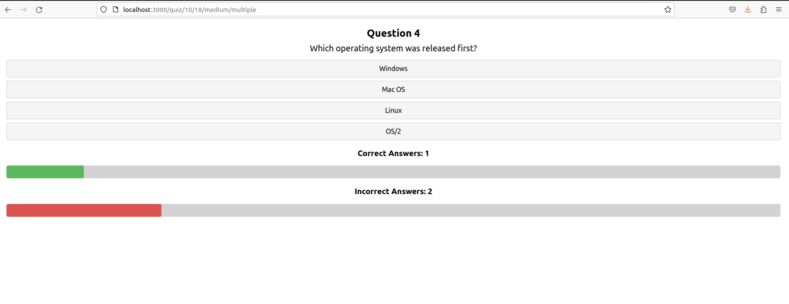

# Getting Started with Create React App

## Installation
 - Clone the repository
 - `npm install` 

 ## How to fix error:0308010C:digital envelope routines::unsupported on NodeJS
 - `npm install webpack@latest`   
 - `npm install react-scripts@5`     
 - To run the application `npm start` 

### Deployment
- I deploy the App on vercel
- The link to the project is here:
    https://simple-quiz-react.vercel.app/

- Main Page:

- Start Quiz

- Quiz Finished - Start again

